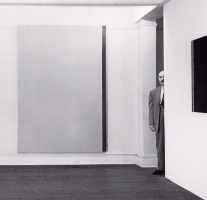

# Barnett

/!\ THIS IS ALPHA. TESTS ARE STILL BEING DONE. DON'T USE.

**Todo**
- [ ] 
- [ ] Complete tests
- [ ] Doc of protected methods

___

A Php zip utility.  
Makes your life easier.  
Zips as good as [Barnett Newman](https://www.moma.org/artists/4285)'s.

## Overview

Set archive destination, source directory and **voilà**.

* Yes, source directory will be crawled recursively.
  * Neat archive tree, mirroring source's one.
  * With the option to set a list of excluded files.
  * Can also target only some file extensions.

* All necessary checks are performed.
  * Errors will be logged.
  * Yes, you can plug in your Psr-3 logger of choice.
  * Or just access in-memory logs.

* An existing archive will not be overwritten.
  * Well, unless specified.
  * Zip filename can be handled for you.
  * Addition of a timestamp on request.

* Comes with finishing moves.
  * Can delete successfully zipped source files.
  * Provide feedback on zipped and shred files. 
  * Oh, and produce an html download link.

### Call with Style

- Barnett's methods can be chained.  
- Since it extends ZipArchive, you can call native methods too.  
- No private thingies, so you can extend it too.

## Install

```bash
composer require ssitu/barnett
```

Also require `ssitu/blueprints`:  
- `FlexLogsTrait` and 
- `FlexLogsInterface` specifically.  

This is a Psr-3 "logger aware" implementation with a fallback.  
If no use of other SSITU blueprints, you can download just those two files.

## How to

### Init

```php
use SSITU\Barnett\Barnett; # Barnett also has an Assistant.
require_once 'path/to/autoload.php';
$Barnett = new Barnett();
```

### Log System

```php
# optional:
$Barnett->setLogger($somePsr3Logger);
# alternatively, you can retrieve logs that way:
$Barnett->getLocalLogs();
// if no logger set: returns all logs history;
// else: only last entry
```

### Simple Bundle

Return zip file's path on success.

```php
$Barnett->zipFast($sourceDirPath, 
                  $zipDirPath, 
                  $zipFilename = null, 
                  $addDate = true, 
                  $overwrite = false);
```

### Chaining

Example:

```php
$zipLink = $Barnett->setZipSource('some/source/dir/path/', ['txt'])
                   ->setZipLocation('some/zip/dir/path/')
                   ->zip() # this won't work if no source / location specified
                   ->shredZippedFiles(['ButNotThisOne.txt'])
                   ->getDownloadLink('https://example.com/aliasPath/');
```

> **Note**  
Setting an alias path for `getDownloadLink()` is not mandatory, but highly recommended.  
Otherwise, your server's file tree could be exposed to the world.

### À la carte

#### Chainable Actions

```php
$Barnett->setZipSource($sourceDirPath, 
                       $theseExtOnly = [], 
                       $omitThesePaths = []);

$Barnett->setZipLocation($zipDirPath, 
                         $zipFilename = null, 
                         $addDate = true, 
                         $overwrite = false);
$Barnett->zip();
$Barnett->shredZippedFiles($omitThesePaths = []);
```

About `$omitThesePaths`:

- Specified paths can be relative to `$sourceDirPath`.  
example: `someFolder/someFile.ext`  
instead of: `Source/Dir/Path/someFolder/someFile.ext`

- To exclude a whole subfolder and its content, only the subfolder path is required.  
example : `['dontTouchMe/']`  
instead of: `['dontTouchMe/','dontTouchMe/file1.ext','dontTouchMe/file2.ext']`


#### Chainable Resetters

```php
$Barnett->resetZipSource();
$Barnett->resetZipLocation();
$Barnett->resetZipLists(); # zippedDir, zippedFiles, and shredResults
$Barnett->resetAll($localLogsToo = true);
```

#### Getters

```php
$Barnett->isGreen(); # false if an error occured

$Barnett->getDownloadLink($aliasDirPath = null, # as said before, avoid null
                          $aliasFilename = null, 
                          $text = 'download');

$Barnett->getZipLocation();
$Barnett->getListOfZippedFiles();
$Barnett->getShredResults();
```

### Assistant's Static Methods

For documentation's sake.

```php
use SSITU\Barnett\Assistant;

# return appropriate ZipArchive flag
Assistant::archiveFlag($overwrite);
# attempt a recursive mkdir if need to
Assistant::affirmDirExistence($dirPath);
# remove zip extension from filename
Assistant::mayRemoveDotZip(&$filename);
# append zip extension to filename
Assistant::mayAppendDotZip(&$filename);
# append an integer to filename
Assistant::findUniqueName(&$zipName);
# append a timestamp to filename
Assistant::fileIsNow(&$zipName);
# cleanup slashes to avoid read/write failures
Assistant::reSlash(&$dirPath, $finalSlash = false);
# check if path is . or ..
Assistant::isDotSegment($path);
# handle extensions list: removes dot, set to lower case and jpeg becomes jpg
Assistant::normalizeExts(&$extensions);
# read a file's extension, set to lower case and jpeg becomes jpg
Assistant::extractNormalizedExt($path);
# resolve file object deletion
Assistant::shred($path);
```

## Contributing

Sure! :raised_hands:
You can take a loot at [CONTRIBUTING](CONTRIBUTING.md).

## License

This project is under the MIT License; cf. [LICENSE](LICENSE) for details.

## Final Words

This is the _plasmic zip_.
Now go do something else.


